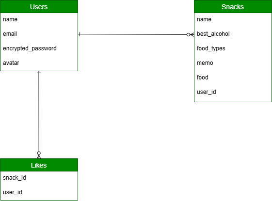

# BEST SNACKS LOG -お酒の相棒、きっと見つかる-

## サービス概要
**お酒のおつまみに迷ったとき、最高の相性のいいおつまみを見つけられるアプリ**

## URL
~~https://best-snacks-log-app-e0b7a7f46bab.herokuapp.com/~~

## 開発背景
最近週に1回以上お酒を飲むようになり、おつまみにこだわるようになりました。他の方はどのようなおつまみでお酒を飲んでいるかが気になり、そのおつまみを投稿でき、見ることができるようになったらいいなと思いこのアプリの開発に至りました。

## ご利用方法

### ユーザー機能
アプリを使用するために、新規登録・ログインorゲストログインが必須です。

### ユーザー編集機能
ユーザー名、パスワード、アイコン画像を編集可能です。

### 投稿機能
ログイン後、右上に「投稿する」ボタンを押すと、入力フォームページになり投稿できます。
 
### 一覧表示機能
おつまみ一覧を見る場合は、検索フォームに未入力の状態で検索ボタンをクリックし閲覧可能です。

### おつまみ編集機能
自分が投稿したおつまみのみ、編集可能です。

## 実装予定の機能

- お気に入り登録機能
- いいね機能
- 投稿削除機能

## ER図

## 主な使用技術

### フロントエンド
- HTML / CSS / JavaScript
- Bootstrap 5.3.3
- Hotwire（Turbo、Stimulus）（インタラクティブUI）

### バックエンド
- Ruby 3.3.3
- Ruby on Rails 7.2.2.1
- PostgreSQL（データベース）

### インフラ・開発環境
- Heroku（デプロイ）
- AWS S3（ストレージ）
- RSpec（テスト）
- Git/GitHub（バージョン管理）
